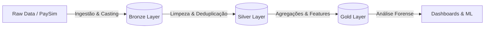
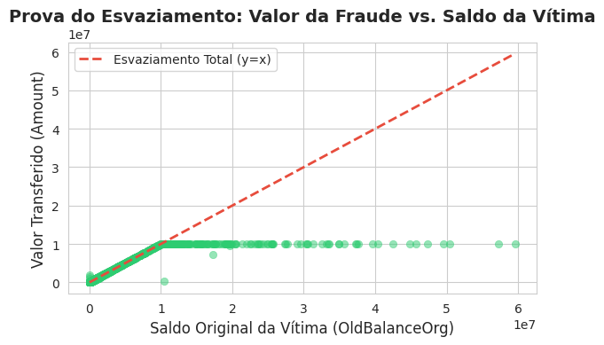
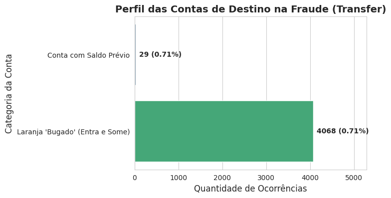

# 🛡️ Mobile Money Fraud Detection (WIP)

> **Projeto de Engenharia de Dados & Data Science** focado na detecção de padrões de lavagem de dinheiro e _Account Takeover_ (ATO) em transações financeiras móveis.

## 💼 O Problema de Negócio: Account Takeover & Lavagem

Fraudes financeiras não são eventos aleatórios, elas deixam rastros digitais. Este projeto utiliza o dataset **PaySim** (simulação de mobile money baseada em logs reais) para arquitetar uma solução capaz de identificar o comportamento de criminosos que tentam "limpar" o dinheiro roubado.

O foco da investigação não é apenas classificar fraudes, mas entender a **mecânica do crime**:

1.  **Account Takeover (ATO):** O invasor assume a conta da vítima.
2.  **Esvaziamento:** A tentativa de transferir o saldo total o mais rápido possível.
3.  **Mulas Digitais:** O uso de contas descartáveis para receber e sacar o dinheiro ilícito.

## 🏗️ Engenharia & Arquitetura (Medallion Architecture)

O projeto segue a arquitetura **Lakehouse** no Databricks, garantindo governança e qualidade de dados em estágios progressivos:

- Bronze Layer: Ingestão bruta dos logs transacionais.
- Silver Layer: Tratamento de tipagem (Schema Enforcement), remoção de duplicatas e limpeza de dados nulos.
- Gold Layer: Tabelas analíticas otimizadas para modelagem, contendo features para representar o comportamento fraudulento.

## 🕵️‍♂️ Data Discovery

Este projeto utilizou uma abordagem Hypothesis-Driven. A Análise Exploratória (EDA) confirmou padrões críticos que fundamentam a detecção:

### A Tese do Esvaziamento (y = x)

Em fraudes do tipo TRANSFER, identificou-se uma correlação linear perfeita entre o saldo da vítima e o valor roubado.

- O fraudador não rouba um valor aleatório. Ele rouba o máximo possível (o saldo total ou o limite do sistema).

  

### Identificação de "Mulas" (Contas Laranjas)

A análise do fluxo de saída revelou que 99.3% das contas destino de fraudes (Mulas) apresentam um comportamento padrão de descarte:

- Saldo Inicial: 0
- Recebimento: Valor da Fraude
- Saldo Final: 0 (Saque Imediato) ou Valor Total (Inconsistência de Log)

## 🛠️ Tech Stack

- Cloud & Compute: Databricks Community Edition (Cluster Spark).
- Processamento Distribuído: PySpark (SparkSQL & Dataframes API).
- Armazenamento: Delta Lake (Parquet otimizado).
- Visualização: Matplotlib & Seaborn (integrados aos Notebooks Databricks).
- Versionamento: Git & GitHub.

## 🚀 Roadmap do Projeto

O projeto está sendo desenvolvido em ciclos iterativos de engenharia e ciência de dados.

- [x] Configuração do Ambiente Databricks & Cluster
- [x] Pipeline ETL (Bronze -> Silver): Ingestão e saneamento de dados.
- [x] Data Discovery (EDA): Validação das hipóteses de fraude e Esvaziamento.
- [x] Feature Engineering: Criação de variáveis preditivas (error_balance, dest_is_mule...).
- [ ] Modelagem Preditiva
- [ ] Deploy

---

📫 Autor do Código: [Patrick Regis](https://www.linkedin.com/in/patrickrgsanjos)
