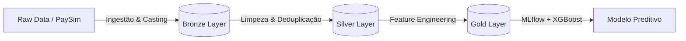
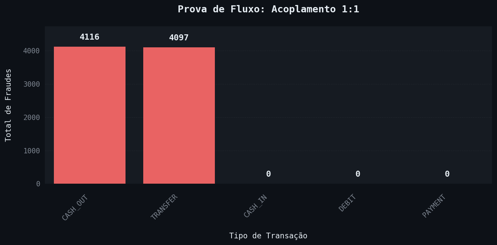
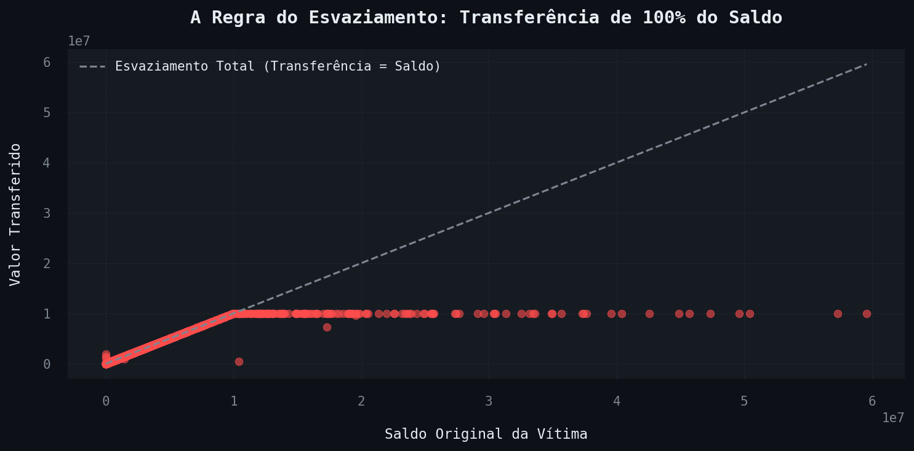
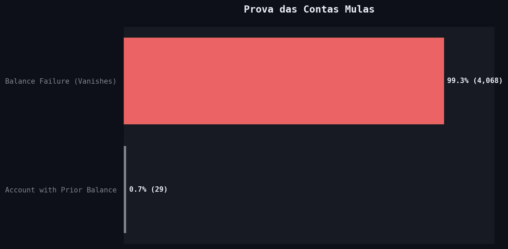

# 🛡️ Mobile Money Fraud Detection


> **Projeto de Engenharia de Dados & Data Science** focado na detecção de padrões de lavagem de dinheiro e _Account Takeover_ (ATO) em transações financeiras móveis.

Este projeto simula um motor de detecção de fraudes para transações financeiras móveis (semelhante ao Pix). O objetivo é processar um grande volume de logs transacionais para identificar padrões anômalos e blindar o sistema contra perdas financeiras.

Diferente de datasets didáticos pequenos, este projeto utiliza o **PaySim**, contendo mais de **6 milhões de registros**, exigindo o uso de tecnologias de Big Data (Spark) para processamento distribuído.

---

## 📂 Dados: PaySim

Uma das maiores barreiras para estudar esse tipo de problema é a privacidade dos dados. Bancos não podem divulgar logs de transações reais devido ao sigilo bancário e leis como a LGPD.

Para contornar esse problema, utilizei o dataset **PaySim: Mobile Money Simulator** (E. A. Lopez-Rojas), um simulador baseado em agentes criado a partir de logs reais de uma rede de _Mobile Money_ na África. Ele replica o comportamento orgânico de transações instantâneas 24/7 e o desbalanceamento extremo presente no mundo real.

- **Fonte:** [Kaggle - PaySim Dataset](https://www.kaggle.com/datasets/ealaxi/paysim1)
- **Volume:** ~6.3 milhões de transações
- **Tamanho:** ~470MB (CSV Bruto)
- **Autor:** Edgar Lopez-Rojas

---

## 💼 O Problema de Negócio

Fraude é a manipulação ilícita de informações para obter benefícios financeiros. Vale destacar a diferença:

- **Golpe (Scam):** A engenharia social usada para enganar a vítima.
- **Fraude:** O ato técnico da transação ilícita.

Para o nosso sistema, pouco importa a natureza do golpe. O que buscamos é o **rastro digital** deixado no banco de dados — especificamente o fenômeno da tomada de conta:

- **Account Takeover (ATO):** Roubo de identidade digital onde um invasor assume o controle total das contas da vítima.

O **Desafio de Negócio** é detectar a minoria fraudulenta (~0.1% dos casos) sem bloquear clientes legítimos, lidando com desbalanceamento severo de classes.

---

## 🏗️ Arquitetura: Medallion Lakehouse

O projeto segue a arquitetura **Lakehouse** no Databricks, utilizando Apache Spark para garantir governança em estágios progressivos:



| Camada | Responsabilidade |
|--------|-----------------|
| **Bronze** | Ingestão bruta com timestamp de chegada |
| **Silver** | Schema enforcement, deduplicação, filtragem por tipo relevante |
| **Gold** | Feature Store com variáveis matemáticas para o modelo |

---

## 🕵️‍♂️ Data Discovery: Abordagem Hypothesis-Driven

O foco desse projeto não é aplicar algoritmos cegamente. Adotei uma abordagem investigativa guiada por uma premissa central:

> **A Tese do Esvaziamento**
>
> Diferente do usuário legítimo, que possui um padrão de consumo orgânico, o invasor age sob a lógica de extração máxima. Com o tempo cronometrado antes que a segurança do banco detecte a invasão, seu objetivo é transferir o saldo total disponível para uma conta externa (mula) e realizar o saque imediatamente.

### ✅ Prova 1: A Regra do Fluxo — Acoplamento 1:1

> **Hipótese:** A fraude só existe em dois momentos: na saída do dinheiro da vítima (TRANSFER) e no saque do criminoso (CASH_OUT).

| Tipo | Total Fraudes |
|------|--------------|
| CASH_OUT | 4116 |
| TRANSFER | 4097 |
| CASH_IN | 0 |
| PAYMENT | 0 |
| DEBIT | 0 |



**Insight:** Existe um acoplamento perfeito. Para cada Transferência fraudulenta, existe um Saque equivalente. Tipos como PAYMENT foram retirados do escopo do modelo.

---

### ✅ Prova 2: O Esvaziamento (y = x)

> **Hipótese:** Na transferência fraudulenta, o criminoso tenta levar o máximo possível, esvaziando a conta.



**Insight:** A linha reta de 45 graus comprova que o valor roubado é igual ao saldo da vítima. Um teto horizontal em 10 Milhões revela o limite transacional (threshold) do sistema bancário.

---

### ✅ Prova 3: O Rastro das Contas Laranja (Mulas)

> **Hipótese:** Contas receptoras (mulas) são descartáveis — nascem zeradas, recebem o dinheiro ilícito e são sacadas imediatamente.



**Insight:** Quase 100% das contas de destino começam zeradas. A inconsistência contábil no saldo final — um "bug" do simulador — é na prática uma feature fortíssima para detectar mulas descartáveis.

---

## ❌ Hipóteses Descartadas

### Falha 1: A Rede de Lavagem
> **Hipótese:** A conta que recebe a transferência fraudulenta é a mesma que realiza o saque logo em seguida.

**Resposta:** Falsa. O PaySim não mantém consistência de identidade da mula ao longo do tempo. Há somente uma instância onde isso ocorre no conjunto inteiro.

### Falha 2: O Horário do Crime
> **Hipótese:** Fraudes geralmente acontecem de madrugada.

**Resposta:** Falsa. O volume absoluto de fraudes é constante nas 24h — possível evidência do uso de bots.

---

## ⚙️ Feature Engineering

Com os insights consolidados, a investigação foi traduzida em vetores matemáticos na Camada Gold:

| Feature | Origem | Significado |
|---------|--------|-------------|
| `ratio_amount_balance` | Prova 2 | Razão entre valor transferido e saldo. Se 1.0, forte indício de fraude |
| `dest_is_empty` | Prova 3 | Flag binária para conta mula descartável |
| `error_orig` | Prova 3 | Inconsistência contábil na conta de origem |
| `error_dest` | Prova 3 | Inconsistência contábil na conta de destino |
| `hour_of_day` | Falha 2 | Padrões temporais — busca por comportamento de bot |
| `balance_was_zeroed` | Prova 2 | Flag se saldo foi completamente zerado após transação |
| `amount_exceeds_balance` | Prova 2 | Flag se valor tentou exceder o saldo disponível |

---

## 🤖 Modelagem: XGBoost + MLflow

O modelo aborda o desbalanceamento severo via **Cost-Sensitive Learning** com `scale_pos_weight=10`, penalizando erros em fraudes mais do que em transações legítimas.

O treinamento utiliza **GridSearchCV** para tuning de hiperparâmetros com validação cruzada (5-fold), e todas as métricas, parâmetros e artefatos são rastreados via **MLflow**.

**Métricas rastreadas:**
- PR-AUC (métrica principal — mais adequada que ROC-AUC para dados desbalanceados)
- F1-Score (padrão e com threshold otimizado)
- Precision, Recall, Accuracy, LogLoss
- Feature Importance (artefato visual)
- Best threshold (otimização por F1)

> ⚠️ **Nota sobre as métricas:** Métricas muito altas em PaySim devem ser interpretadas com cautela. Por ser um dataset sintético, o modelo pode estar aprendendo a lógica do simulador em vez de generalizar padrões reais de fraude. Em produção, validação com dados reais seria obrigatória.

---

## 🛠️ Tech Stack

| Categoria | Tecnologias |
|-----------|-------------|
| **Cloud & Compute** | Databricks Community Edition |
| **Processamento** | PySpark, SparkSQL, Delta Lake |
| **ML & Tracking** | XGBoost, Scikit-learn, MLflow |
| **Orquestração** | Pipeline modular em Python (`src/`) |
| **Visualização** | Matplotlib, Seaborn |
| **Versionamento** | Git & GitHub |

---

## 📂 Estrutura do Repositório

```text
mobile-money-fraud/
├── config/
│   ├── config.yaml           # Paths e parâmetros (não versionado)
│   └── config.example.yaml   # Template de configuração
├── imgs/                     # Gráficos gerados na EDA
├── src/
│   ├── medallion_utils.py    # Funções ETL: ingest_bronze, process_silver, process_gold
│   ├── train_xgboost.py      # Função run_training: GridSearch + MLflow
│   └── 00_main               # Notebook orquestrador do pipeline completo
├── eda_reference             # Notebook de análise exploratória e storytelling
└── README.md
```

---

## 🚀 Roadmap

- [x] Configuração do Ambiente Databricks & Cluster
- [x] Pipeline ETL Orquestrado (Bronze → Silver → Gold)
- [x] Data Discovery: Validação de hipóteses
- [x] Feature Engineering: Construção da ABT (Analytical Base Table)
- [x] Modelagem Preditiva com XGBoost + MLflow (Cost-Sensitive Learning)
- [ ] Threshold Optimization & Avaliação Final
- [ ] Deploy

---

## 📚 Bibliografia

- [DIMENSA. Fraude bancária: saiba o que é e como se proteger.](https://dimensa.com/blog/fraude-bancaria/)
- [UNODC. Money-Laundering Cycles.](https://www.unodc.org/e4j/en/organized-crime/module-4/key-issues/money-laundering.html)
- [EUROPOL. Money Muling.](https://www.europol.europa.eu/crime-areas-and-statistics/crime-areas/forgery-of-money-and-means-of-payment/money-muling)
- [Lopez-Rojas, E. A. PaySim: Mobile Money Simulator. Kaggle.](https://www.kaggle.com/datasets/ealaxi/paysim1)

---

📫 **Autor:** [Patrick Regis](https://www.linkedin.com/in/patrickrgsanjos)