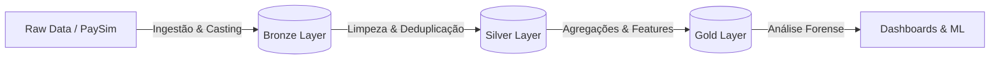

# 🛡️ Mobile Money Fraud Detection (WIP)


> **Projeto de Engenharia de Dados & Data Science** focado na detecção de padrões de lavagem de dinheiro e _Account Takeover_ (ATO) em transações financeiras móveis.

Este projeto simula um motor de detecção de fraudes para transações financeiras móveis (semelhante ao Pix). O objetivo é processar um grande volume de logs transacionais para identificar padrões anômalos e blindar o sistema contra perdas financeiras.

Diferente de datasets didáticos pequenos, este projeto utiliza o **PaySim**, contendo mais de **6 milhões de registros**, exigindo o uso de tecnologias de Big Data (Spark) para processamento distribuído.

## 📂 Dados: PaySim

Uma das maiores barreiras para estudar esse tipo de problema é a privacidade dos dados. Bancos não podem divulgar logs de transações reais devido ao sigilo bancário e leis como a LGPD.

Para contornar esse problema, utilizei o dataset **PaySim: Mobile Money Simulator** (E. A. Lopez-Rojas), um simulador baseado em agentes criado a partir de logs reais de uma rede de _Mobile Money_ na África. Ele replica o comportamento orgânico de transações instantâneas 24/7 e o desbalanceamento extremo presente no mundo real (fraudes representam uma fração muito pequena do volume total).

- **Fonte:** [Kaggle - PaySim Dataset](https://www.kaggle.com/datasets/ealaxi/paysim1)
- **Volume:** ~6.3 milhões de transações (Simulação de Big Data Real)
- **Tamanho:** ~470MB (CSV Bruto)
- **Autor:** Edgar Lopez-Rojas

## 💼 O Problema de Negócio

Segundo a **Dimensa (2023)**, fraude é a manipulação ilícita de informações para obter benefícios financeiros. Vale lembrar que fraude é diferente de golpe:

- **Golpe (Scam):** É a engenharia social, a lábia usada para enganar a vítima.
- **Fraude:** É o ato técnico da transação ilícita.

Para o nosso sistema, pouco importa a natureza do golpe. O que buscamos é o **rastro digital** deixado no banco de dados. Quando analisamos o cenário de transações móveis instantâneas, aposta-se no fenômeno da tomada de conta:

- **Account Takeover (ATO) — Tomada de Conta:** É o roubo de identidade digital onde um invasor assume o controle total das contas da vítima.

O **Desafio de Negócio** é detectar a minoria fraudulenta (0.1% dos casos) sem bloquear clientes legítimos (Falsos Positivos), lidando com o severo desbalanceamento de classes.

## 🏗️ Engenharia & Arquitetura (Medallion Architecture)

O projeto segue a arquitetura **Lakehouse** no Databricks, utilizando a engine do **Apache Spark** para garantir governança em estágios progressivos:



- Bronze Layer: Ingestão bruta dos logs transacionais.
- Silver Layer: Tratamento de tipagem (Schema Enforcement), remoção de duplicatas e limpeza de dados.
- Gold Layer: Tabelas analíticas otimizadas (Feature Store) contendo variáveis matemáticas para representar o comportamento criminoso.

## 🕵️‍♂️ Data Discovery: Uma Abordagem Hypothesis-Driven

O foco desse projeto não é aplicar algoritmos cegamente em busca de padrões. Adotei uma abordagem investigativa guidada pela seguinte premissa:

> **A Tese do Esvaziamento**
>
> Diferente do usuário legítimo, que possui um padrão de consumo orgânico, o invasor age sob a lógica de extração máxima. Com o tempo cronometrado antes que a segurança do banco detecte a invasão, seu objetivo é transferir o saldo total disponível para uma conta externa (mula) e realizar o saque imediatamente, ocultando a origem do dinheiro.

### Prova 1: A Regra do Fluxo - Acoplamento 1:1

> Hipótese: A fraude só existe em dois momentos: na saída do dinheiro da vítima (Roubo) e no saque do criminoso (Lavagem).

```python
from pyspark.sql import functions as F

flow_proof = df_final.groupBy("type") \
    .agg(F.sum("is_fraud").alias("total_fraudes")) \
    .withColumnRenamed("type", "tipo") \
    .orderBy("total_fraudes", ascending = False)
```

| Tipo     | Total_Fraudes |
| -------- | ------------- |
| CASH_OUT | 4116          |
| TRANSFER | 4097          |
| CASH_IN  | 0             |
| PAYMENT  | 0             |
| DEBIT    | 0             |


**Insight:** Existe um acoplamento perfeito. Para cada Transferência fraudulenta, existe um Saque equivalente. Tipos como PAYMENT (pagar boleto) são ruídos e foram retirados do escopo do modelo.

### Prova 2: O Esvaziamento (y = x)

> Hipótese: Na transferência fraudulenta, o criminoso tenta levar o máximo possível, esvaziando a conta.

```python
emptying_proof = df_focus \
  .filter((F.col("is_fraud") == 1) & (F.col("type") == "TRANSFER")) \
  .select(F.col("old_balance_org"), F.col("amount"))
```


**Insight:** A linha reta de 45 graus comprova que o valor roubado é igual ao saldo da vítima. Nota-se também um teto horizontal em 10 Milhões, revelando que, mesmo com fundos infinitos, o fraudador esbarra no limite transacional (Threshold) do sistema bancário.

### Prova 3: O Rastro das Contas Laranja (Mulas)

> Hipótese: Contas receptoras (mulas) são descartáveis. Elas nascem zeradas, recebem o dinheiro ilícito e são sacadas imediatamente.

```python
prova_laranja = df_focus \
    .filter((F.col("is_fraud") == 1) & (F.col("type") == "TRANSFER")) \
    .withColumn(
        "tipo_mula",
        F.when((F.col("old_balance_dest") == 0) & (F.col("new_balance_dest") == F.col("amount")), "Laranja Perfeito (Entra e Fica)")
         .when((F.col("old_balance_dest") == 0) & (F.col("new_balance_dest") == 0), "Falha no Saldo (Entra e Some)")
         .otherwise("Conta com Saldo Prévio")
    )
```


**Insight:** Quase 100% das contas de destino começam zeradas, mas o saldo final não atualiza de forma consistente no log após a transferência. Essa inconsistência contábil (um "bug" do simulador) é, na verdade, uma feature fortíssima para detectar mulas descartáveis.

## ❌ As Hipóteses Descartadas

### Falha 1: A Rede de Lavagem

> Hipótese: A conta que recebe a transferência fraudulenta (name_dest em TRANSFER) é a mesma conta que realiza o saque logo em seguida (name_orig em CASH_OUT).

**Resposta:** Falha. O PaySim não mantém a consistência da identidade da mula ao longo do tempo (IDs reutilizados ou aleatórios). Há somente uma instância onde isso ocorre no conjunto inteiro.

### Falha 2: O Horário do Crime

> Hipótese: Fraudes geralmente acontecem de madrugada.

**Resposta:** Falha. Volume absoluto de fraudes é constante nas 24h. Por demonstrar intensidade similar durante o dia inteiro, pode ser prova do uso de bots.

## ⚙️ Feature Engineering - Traduzindo o Crime em Variáveis

Com os insights consolidados, traduzimos a investigação humana em vetores matemáticos (Camada Gold) para o modelo preditivo:

- Esvaziamento $(y=x)$: Razão `ratio_amount_balance`. Se for 1.0, forte indício de fraude.
- Mula Descartável: Criada a flag binária `dest_is_empty`.
- Inconsistência Contábil: Criadas as distâncias matemáticas `error_orig` e `error_dest`.
- Automação (Bots): Criada a conversão `hour_of_day` para buscar padrões não biológicos.

## 🛠️ Tech Stack

- **Cloud & Compute:** Databricks Community Edition (Cluster Spark).
- **Processamento Distribuído:** PySpark (SparkSQL & Dataframes API).
- **Armazenamento:** Delta Lake (Parquet otimizado com schema enforcement).
- **Visualização:** Matplotlib & Seaborn.
- **Versionamento:** Git & GitHub.

## 📂 Estrutura do Repositório

O projeto foi construído com foco em modularidade, separando configurações, exploração e orquestração de pipeline:

```text
mobile-money-fraud/
├── conf/                  # Arquivos de configuração paramétrica (base_config.yaml)
├── imgs/                  # Imagens e gráficos gerados para documentação
├── notebooks/             # Scripts Databricks isolados por responsabilidade
│   ├── 00_eda_reference.ipynb    # Análise Exploratória e Data Storytelling
│   ├── 01_bronze_to_silver.ipynb # Limpeza, tipagem e deduplicação
│   ├── 02_silver_to_gold.ipynb   # Regras de negócio e Feature Engineering
│   └── 03_pipeline_exec.ipynb    # Orquestrador (Master) do pipeline de dados
├── src/                   # WIP
└── README.md              # Documentação principal do projeto
```

## 🚀 Roadmap do Projeto

O projeto é desenvolvido em ciclos iterativos de engenharia e ciência de dados:

- [x] Configuração do Ambiente Databricks & Cluster
- [x] Pipeline ETL Orquestrado (Bronze -> Silver -> Gold).
- [x] Data Discovery (EDA): Validação de hipóteses.
- [x] Feature Engineering: Construção da Analytical Base Table (ABT).
- [ ] Modelagem Preditiva (Lidando com Desbalanceamento Severo com Cost-Sensitive Learning).
- [ ] Deploy

## 📚 Bibliografia

- [DIMENSA. Fraude bancária: saiba o que é e como se proteger.](https://dimensa.com/blog/fraude-bancaria/)
- [UNITED NATIONS OFFICE ON DRUGS AND CRIME (UNODC). Money-Laundering Cycles.](https://www.unodc.org/e4j/en/organized-crime/module-4/key-issues/money-laundering.html)
- [EUROPOL. Money Muling. Crime Areas: Financial Crime.](https://www.google.com/search?q=https://www.europol.europa.eu/crime-areas-and-statistics/crime-areas/forgery-of-money-and-means-of-payment/money-muling)

---

📫 Autor do Código: [Patrick Regis](https://www.linkedin.com/in/patrickrgsanjos)
